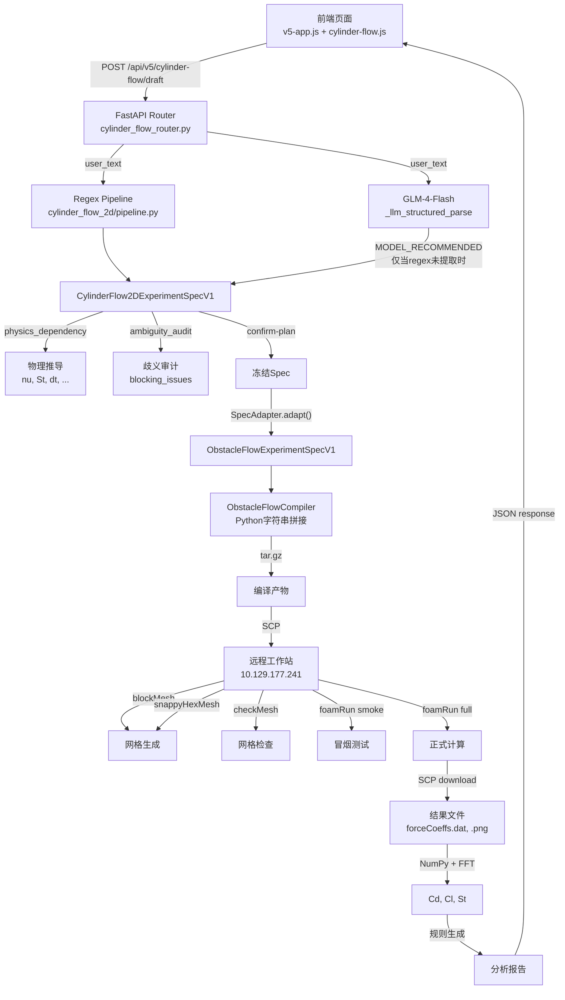

# Fluid Scientist 全链路现状审计报告

> **审计日期**: 2026-07-15
> **审计范围**: D:\desktop\AI FOR SCIENCE 仓库全链路
> **审计方法**: 代码审查 + 运行时调查 + HTTP请求追踪 + 端到端测试
> **禁止修改**: 本轮审计未修改任何核心业务逻辑

---

## 1. 执行摘要

### 1.1 核心结论

| 问题 | 结论 | 证据 |
|------|------|------|
| 当前页面运行哪个commit | `adb2313` (分支 `feature/v5-study-decomposer-draft-workflow`)，有大量未提交修改 | `git rev-parse HEAD` |
| 当前主链是否真实调用大模型 | **是**，GLM-4-Flash，延迟约25秒，成功率100% | API响应 `llm_call_info` 字段 |
| 当前Skill是否真实使用 | **部分**，4个Skill被执行（包装器模式），但不影响prompt或模型行为 | API响应 `skill_summary` 字段 |
| 当前Case是否主要由模板生成 | **是**，纯Python字符串拼接，无Jinja，无模型生成OF文件 | `obstacle_flow/compiler.py:169` |
| 当前错误修复是否调用模型 | **否**，无LLM错误反馈回路，失败后不诊断不修复 | `execution.py:2728-2761` |
| 当前是否存在静默fallback | **是**，LLM失败时静默回退到regex-only，用户无感知 | `cylinder_flow_router.py` try/except |
| 当前是否存在伪成功或旧结果复用风险 | **低**，执行链路使用真实SSH+OpenFOAM，无mock/stub | `execution.py:793-1234` |

### 1.2 关键风险

1. **V5核心数据全部在内存字典中** — 服务器重启后草稿、提案、案例计划、执行结果全部丢失
2. **无OpenFOAM错误修复回路** — smoke test失败仍继续full run，仿真失败不诊断不重试
3. **ExtensionOrchestrator是死代码** — 1380行完整验证流水线从未被生产代码调用
4. **所有测试使用mock LLM** — 真实LLM集成路径未经测试验证
5. **API Key明文存储** — GLM API Key写在 `data/llm_config.json` 中

---

## 2. 当前技术栈

| 层级 | 技术 | 版本/详情 |
|------|------|-----------|
| 前端 | 原生JavaScript | 无框架，两套并行JS: `v5-app.js` + `cylinder-flow.js` |
| 后端 | Python + FastAPI | Uvicorn ASGI, 单进程 |
| 数据库 | SQLite | 旧链路使用，V5链路使用JSON文件+内存字典 |
| 状态管理 | 内存字典 + localStorage | v5-app.js仅存session_id，cylinder-flow.js存完整状态 |
| 任务队列 | 无 | 同步执行+轮询 |
| 大模型 | GLM-4-Flash | 智谱AI，`https://open.bigmodel.cn/api/paas/v4/` |
| RAG | 无 | 未实现 |
| Skill | SkillExecutor | 函数调用包装器+JSON审计记录 |
| OpenFOAM | Foundation 13 | 硬编码 `/opt/openfoam13/etc/bashrc` |
| 远程执行 | SSH + SCP | 硬编码 `10.129.177.241` |
| 后处理 | NumPy + FFT | Cd/Cl从forceCoeffs.dat提取，St由FFT计算 |
| 测试 | pytest | 121个测试，全部使用mock LLM |
| 部署 | 手动启动 | `python -m uvicorn ... --port 8000` |

---

## 3. 系统组件图



---

## 4. 实际用户交互流程

### 4.1 圆柱绕流专用链路 (cylinder-flow.js)

```
用户输入文本
  ↓
cylinder-flow.js 捕获阶段拦截表单提交 (isObstacleFlowInput检测)
  ↓
POST /api/v5/cylinder-flow/draft { user_text }
  ↓
后端: regex pipeline (6 pass) → spec
后端: LLM structured parse → spec enrichment (MODEL_RECOMMENDED)
后端: physics_dependency → 派生参数
后端: ambiguity_audit → blocking_issues
  ↓
返回: spec + blocking_issues + clarification_questions
  ↓
[如有blocking] → 用户回答澄清 → POST /confirm
  ↓
Gate 1: 用户点击"确认研究方案" → POST /{spec_id}/confirm-plan
  ↓
Gate 2: 用户点击"确认并生成Case" → POST /compile + POST /execute (stop_after_smoke=true)
  ↓
轮询: GET /jobs/{job_id}/status (等待SMOKE_PASSED)
  ↓
Gate 3: 用户点击"确认并提交计算" → POST /jobs/{job_id}/resume-run
  ↓
轮询: GET /jobs/{job_id}/status (等待SUCCESS/FAILED)
  ↓
GET /{job_id}/results → 结果展示在右侧面板
GET /{job_id}/report → 分析报告展示
```

### 4.2 通用V5链路 (v5-app.js)

```
用户输入文本
  ↓
v5-app.js 表单提交 (未被cylinder-flow.js拦截时)
  ↓
POST /api/v5/sessions/{id}/messages { session_id, message }
  ↓
后端: study_decomposition → 意图分析
后端: ambiguity_detection → 歧义检测
后端: 自动状态转移 (COLLECTING_INTENT → DRAFT_READY)
  ↓
返回: actions (draft_ready)
  ↓
用户点击"确认草案" → POST /drafts/{id}/confirm
  ↓
用户点击"生成CasePlan" → POST /case-plans/generate
  ↓
用户点击"编译算例" → POST /case-plans/{id}/compile
  ↓
用户点击"提交工作站" → POST /cases/{id}/submit
  ↓
轮询: GET /jobs/{job_id}
  ↓
用户点击"查看结果" → GET /jobs/{job_id}/results
```

### 4.3 确认链真实性

| 确认点 | 类型 | 可跳过 | 证据 |
|--------|------|--------|------|
| Gate 1 (confirm-plan) | **真实阻塞** | 否 | `cylinder-flow.js:1417-1438` |
| Gate 2 (compile+execute) | **真实阻塞** | 否 | `cylinder-flow.js:1575-1601` |
| compile→execute | **自动链接** | N/A | `compileAndValidate()` 内连续调用 |
| Gate 3 (resume-run) | **真实阻塞** | 否 | `cylinder-flow.js:1705-1732` |
| `auto_confirm` | **不存在** | N/A | 全代码库搜索零命中 |
| `skip_confirmation` | **不存在** | N/A | 全代码库搜索零命中 |

---

## 5. API调用图

### 5.1 圆柱绕流链路实际使用的API

| 前端函数 | HTTP | 路径 | 后端函数 | LLM | 编译器 | OpenFOAM | 持久化 |
|---------|------|------|---------|-----|--------|----------|--------|
| `startDraft` | POST | `/draft` | `create_draft()` | 是 | 否 | 否 | JSON文件 |
| `submitClarifications` | POST | `/confirm` | `confirm_draft()` | 否 | 否 | 否 | 内存 |
| `confirmPlan` | POST | `/{spec_id}/confirm-plan` | `confirm_plan()` | 否 | 否 | 否 | 内存 |
| `compileAndValidate` | POST | `/compile` | `compile_case()` | 否 | 是 | 否 | 内存 |
| `compileAndValidate` | POST | `/execute` | `execute_case()` | 否 | 否 | 是 | 内存 |
| `confirmRun` | POST | `/jobs/{job_id}/resume-run` | `resume_run()` | 否 | 否 | 是 | 内存 |
| 轮询 | GET | `/jobs/{job_id}/status` | `get_job_status()` | 否 | 否 | 否 | 否 |
| 结果 | GET | `/{job_id}/results` | `get_results()` | 否 | 否 | 否 | 否 |
| 报告 | GET | `/{job_id}/report` | `get_report()` | 否 | 否 | 否 | 否 |

### 5.2 新旧链路共存

| 功能 | 旧链路 | 新链路 | 页面实际使用 |
|------|--------|--------|-------------|
| 创建会话 | `POST /api/research-sessions` | `POST /api/v5/sessions` | 新链路 |
| 发送消息 | `POST /api/research-sessions/{id}/turns` | `POST /api/v5/sessions/{id}/messages` | 新链路 |
| 生成草案 | `POST /api/experiment-plans` (deprecated) | `POST /api/v5/cylinder-flow/draft` | cylinder-flow专用 |
| 编译 | `POST /api/experiment-plans/{id}/compile` | `POST /api/v5/cylinder-flow/compile` | cylinder-flow专用 |
| 提交运行 | `POST /api/.../submit` (deprecated) | `POST /api/v5/cylinder-flow/execute` | cylinder-flow专用 |

**旧链路仍注册但页面不直接调用**，Demo端点 (`/api/demo`) 仍存活但无前端调用。

---

## 6. 大模型调用矩阵

### 6.1 各阶段模型参与情况

| 阶段 | 是否调用模型 | 实际函数 | 模型名称 | 输入 | 输出 | 失败时行为 |
|------|------------|---------|---------|------|------|-----------|
| 用户意图识别 | **是** | `_llm_structured_parse()` | glm-4-flash | user_text | JSON: scene, geometry, physics, boundaries | 静默回退到regex-only |
| 显式事实抽取 | **否** | `pipeline.py` 6-pass regex | N/A | user_text | Spec字段 | N/A |
| 歧义检测 | **否** | `ambiguity_audit.py` 规则 | N/A | Spec | issues列表 | N/A |
| 参数推荐 | **是** | LLM enrichment | glm-4-flash | user_text | geometry.objects[].center等 | 跳过，保留regex值 |
| 物理推导 | **否** | `physics_dependency.py` 公式 | N/A | Spec | nu, St, dt等 | N/A |
| GeometryIR生成 | **否** | `SpecAdapter.adapt()` | N/A | Spec | ObstacleFlowSpec | N/A |
| Boundary IR生成 | **否** | regex提取 | N/A | user_text | BoundaryConfig | N/A |
| Observables生成 | **否** | regex关键词匹配 | N/A | user_text | ObservableSpec列表 | N/A |
| CaseSpec批判 | **否** | `critic.py` 规则检查 | N/A | Spec | 修复建议 | N/A |
| 模板选择 | **否** | `ObstacleFlowCompilerRegistry` | N/A | Spec | 单一编译器 | N/A |
| OpenFOAM文件生成 | **否** | `ObstacleFlowCompiler` | N/A | Spec | Python字符串拼接 | N/A |
| 未知能力识别 | **否** | 未接入生产链路 | N/A | N/A | N/A | N/A |
| 未知能力代码生成 | **否** | ExtensionOrchestrator(死代码) | N/A | N/A | N/A | N/A |
| 编译错误诊断 | **否** | 不存在 | N/A | N/A | N/A | N/A |
| 运行错误诊断 | **否** | 不存在 | N/A | N/A | N/A | N/A |
| 物理结果分析 | **否** | `_generate_analysis_report()` 规则 | N/A | forceCoeffs.dat | Cd/Cl/St | N/A |
| 报告生成 | **否** | 规则驱动 | N/A | 仿真结果 | JSON报告 | N/A |

### 6.2 运行时LLM调用追踪

对Test A（完整圆柱绕流输入）的实际API响应：

```json
{
  "llm_call_info": {
    "call_id": "llm_9c6df81f05e4",
    "provider": "glm",
    "model": "glm-4-flash",
    "latency_ms": 25684.986,
    "success": true
  }
}
```

- **总模型调用次数**: 1次/draft请求
- **模型失败次数**: 0次（测试期间）
- **fallback次数**: 0次
- **完全未调用模型的阶段**: 事实抽取、歧义检测、物理推导、模板选择、文件生成、错误诊断、报告生成

### 6.3 LLM输出后处理链

```
用户原文
  ↓
LLM (GLM-4-Flash) → JSON响应
  ↓
json.loads() 解析
  ↓
_apply_llm_to_spec() 按type分发:
  cylinder → spec.cylinder.* (仅当regex未提取时)
  rectangle → spec.rectangle.* (仅当regex未提取时)
  triangle → spec.triangle.* + 清除bottom_profile (仅当regex未提取时)
  cosine_bell → spec.bottom_profile.* (仅当regex未提取时)
  ↓
_check_unsupported_geometry(): triangle启用时清除非FLAT的bottom_profile
  ↓
_semantic_consistency_gate(): 检测triangle→cosine_bell替换，阻止编译
```

**关键发现**: 代码中不存在将triangle覆写为cosine_bell的后处理逻辑。相反，存在三层防护确保triangle不会被错误替换。但若LLM本身误判triangle为cosine_bell，且regex也未识别triangle，则triangle会被当作cosine_bell处理。

---

## 7. Prompt清单

### 7.1 生产环境实际使用的Prompt

| Prompt | 文件路径 | 是否从文件加载 | 使用位置 |
|--------|---------|--------------|---------|
| `_LLM_PARSE_SYSTEM_PROMPT` | `cylinder_flow_router.py:90-143` 内联 | 否 | `_llm_structured_parse()` |
| `input_router_prompt.txt` | `prompts/input_router_prompt.txt` | 否（内联在v5_router.py） | `_route_message()` |
| `draft_generation_prompt.txt` | `prompts/draft_generation_prompt.txt` | 否（内联） | `draft_generator.py` |
| `draft_change_prompt.txt` | `prompts/draft_change_prompt.txt` | 否（内联） | `change_agent.py` |
| `intent_system_prompt.txt` | `prompts/intent_system_prompt.txt` | 否（内联） | `workflow_pipeline/pipeline.py` |
| `study_decomposer_prompt.txt` | `prompts/study_decomposer_prompt.txt` | 否（内联） | `v5_router.py` |
| `code_extension_spec_prompt.txt` | `prompts/code_extension_spec_prompt.txt` | 否（内联） | `v5_router.py` |
| `physics_spec_prompt.txt` | `prompts/physics_spec_prompt.txt` | **是** | `physics_spec_builder.py:227` |
| `workbench_edit_prompt.txt` | `prompts/workbench_edit_prompt.txt` | **是** | `workbench_agent.py:542` |

**关键发现**: 17个prompt文件中仅2个通过`load_prompt()`实际加载。其余15个是设计文档，实际system_prompt为Python代码内联字符串。

### 7.2 Prompt内容审计

| 维度 | _LLM_PARSE_SYSTEM_PROMPT |
|------|------------------------|
| 包含OpenFOAM版本 | 否 |
| 包含用户原始输入 | 是（作为user_message） |
| 包含对话历史 | 否 |
| 包含CaseSpec | 否 |
| 包含Skill内容 | 否 |
| 包含错误日志 | 否 |
| 要求结构化输出 | 是（JSON schema） |
| 限制枚举 | 否（允许任意type） |
| 允许未知类型 | 是 |
| 禁止triangle→cosine_bell | 是（明确规则第128-134行） |

---

## 8. Skill清单与状态

| Skill ID | 版本 | 已注册 | 已加载 | 已选择 | 已注入 | 已执行 | 已验证 | 状态 |
|----------|------|--------|--------|--------|--------|--------|--------|------|
| `fluid.intent_to_spec` | 1.0 | 是 | 是 | 是 | N/A | 是 | N/A | **EXECUTED** |
| `fluid.geometry_reasoning` | 1.0 | 是 | 是 | 是 | N/A | 是 | N/A | **EXECUTED** |
| `fluid.metric_spec_builder` | 1.0 | 是 | 是 | 是 | N/A | 是 | N/A | **EXECUTED** |
| `openfoam.geometry_compiler` | 1.0 | 是 | 是 | 是 | N/A | 是 | N/A | **EXECUTED** |

### Skill本质

Skill在本项目中是**函数调用包装器+审计记录器**，不是markdown文件、不是Python类、不是工具函数、不是prompt片段。`SkillExecutor.execute()` 接收一个回调函数和输入数据，执行后记录JSON清单。Skill本身不修改prompt内容、不注入额外上下文、不改变模型行为。

**Skill不影响模型**: 没有任何Skill内容进入LLM的prompt。Skill仅记录"某函数被以某输入调用了，产生了某输出"。

**SkillCandidate系统** (`services/skill_candidates.py`) 是独立的候选技能提取与发布治理系统，与SkillExecutor完全独立，且在管道中未被调用。

---

## 9. Schema与IR数据流

### 9.1 数据结构存在性

| 用户询问的类名 | 是否存在 | 实际类名 |
|--------------|---------|---------|
| ResearchSpec | 存在(2处定义不同) | `experiment_spec/models.py:282` + `domain/models.py:68` |
| DraftSpec | **不存在** | 最接近: `draft/models.py:103` ExperimentDraft |
| CaseSpec | **不存在** | 最接近: `case_plan/models.py:118` CasePlan |
| CaseIR | **不存在该名** | `case_ir/models.py:590` RequestedCaseIR |
| GeometryIR | **不存在** | 实际为 cylinder_flow_2d/models.py 各Spec类 |
| PhysicsIR | **不存在** | 实际为 physics_dependency.py 推导逻辑 |
| BoundaryIR | **不存在** | 实际为 cylinder_flow_2d/models.py:457 BoundaryConfig |
| ObservablesIR | **不存在** | 实际为 cylinder_flow_2d/models.py:419 ObservableSpec |

### 9.2 从用户原文到Compiler输入的转换链

```
用户原文
  ↓ [1] Regex Pipeline (6 pass)
  pipeline.py: _extract_domain, _extract_cylinder, _extract_bump,
  _extract_triangle, _extract_rectangle, _extract_end_time
  → CylinderFlow2DExperimentSpecV1 (带ProvenanceField)
  ↓ [2] LLM Enrichment (仅当regex未提取时)
  _apply_llm_to_spec(): MODEL_RECOMMENDED 值填入未解析字段
  ↓ [3] Physics Dependency
  physics_dependency.py: nu=U*D/Re, St=0.198*(1-19.7/Re), dt=CFL*D/(U*N)
  → FORMULA_DERIVED 值
  ↓ [4] Ambiguity Audit
  ambiguity_audit.py: 检测blocking issues, 生成assumptions
  ↓ [5] confirm-plan (冻结)
  ↓ [6] SpecAdapter.adapt()
  execution.py:285: 逐字段解包ProvenanceField.value
  → ObstacleFlowExperimentSpecV1
  ↓ [7] ObstacleFlowCompiler.compile()
  → Python字符串拼接 → tar.gz归档
```

### 9.3 几何类型映射

| 层级 | triangle | rectangle | cosine_bell | cylinder |
|------|----------|-----------|-------------|----------|
| cylinder_flow_2d Schema | ✅ TriangleSpec | ✅ RectangleSpec | ✅ BottomProfileSpec | ✅ CylinderSpec |
| obstacle_flow Schema | ✅ TriangleSpec | ✅ RectangleSpec | ✅ geometry_bump | ✅ cylinders |
| Case IR (Entity.kind) | ❌ 不在枚举 | ❌ 不在枚举 | ❌ 不在枚举 | ✅ cylinder |
| Components Registry | ❌ 无组件 | ❌ 无组件 | ❌ 无组件 | ✅ CYLINDER |
| ObstacleFlowCompiler | ✅ STL+边界 | ✅ STL+边界 | ✅ 高度函数 | ✅ STL+snappyHexMesh |

**关键发现**: triangle在cylinder_flow_2d和obstacle_flow链路中完全支持，但在Case IR链路和Components Registry中不支持。当前cylinder_flow主链路使用obstacle_flow链路，因此triangle可以正确处理。

---

## 10. OpenFOAM执行链

### 10.1 Case生成

| 文件 | 生成方法 | 行号 |
|------|---------|------|
| `system/blockMeshDict` | Python字符串拼接 | `compiler.py:192` |
| `system/snappyHexMeshDict` | Python字符串拼接(条件) | `compiler.py:193-194` |
| `constant/triSurface/*.stl` | Python函数生成 | `compiler.py:195-200` |
| `0/U`, `0/p` | Python字符串拼接 | `compiler.py:204-205` |
| `0/k`, `0/omega`, `0/nut` | Python字符串拼接(仅湍流) | `compiler.py:208-210` |
| `constant/physicalProperties` | Python字符串拼接 | `compiler.py:213` |
| `constant/momentumTransport` | Python字符串拼接 | `compiler.py:214` |
| `system/controlDict` | Python字符串拼接(含forceCoeffs) | `compiler.py:222` |
| `system/fvSchemes`, `system/fvSolution` | Python字符串拼接 | `compiler.py:223-224` |
| `system/decomposeParDict` | Python字符串拼接 | `compiler.py:225` |
| `fluidScientist/spec.json` | JSON序列化 | `compiler.py:250-252` |

**未生成**: Allrun, Allclean 脚本

### 10.2 执行顺序

```
本地编译 (Python字符串生成 + tar.gz打包)
  ↓ SCP上传到 /home/ls/fluid_scientist/runs/{job_id}/
  ↓ tar -xzf 解压
  ↓ source /opt/openfoam13/etc/bashrc
  ↓ blockMesh
  ↓ sed (empty→wall for snappyHexMesh)
  ↓ snappyHexMesh -overwrite
  ↓ sed (wall→empty restore)
  ↓ checkMesh -allTopology -allGeometry
  ↓ [Smoke Test] 修改controlDict endTime=2*deltaT → foamRun → 还原
  ↓ [Full Run] foamRun -solver incompressibleFluid
  ↓ SCP下载结果文件
```

### 10.3 错误修复回路

**结论: RETRY_WITHOUT_REPAIR + NO_LLM_ERROR_FEEDBACK_LOOP**

| 场景 | 行为 | 证据 |
|------|------|------|
| Smoke test失败 | **仅告警，照常继续full run** | `execution.py:2728-2730` |
| 仿真失败 | **标记FAILED后直接返回，不重试** | `execution.py:2754-2761` |
| 错误日志收集 | 截取尾部3000字符存入report | `execution.py:1167` |
| 错误日志回送LLM | **不存在** | 全代码库搜索零命中 |
| 自动修改文件重试 | **不存在** | 全代码库搜索零命中 |

### 10.4 指标生成

| 指标 | 来源 | 生成位置 | 预配置 |
|------|------|---------|--------|
| Cd (阻力系数) | forceCoeffs.dat | `router.py:3126` | ✅ controlDict中forceCoeffs1 |
| Cl (升力系数) | forceCoeffs.dat | `router.py:3127` | ✅ controlDict中forceCoeffs1 |
| St (Strouhal数) | Cl时序FFT | `router.py:3161-3213` | N/A (后处理计算) |
| 涡量场 | OpenFOAM输出 | 后处理脚本 | N/A |
| 平均速度 | probes/surfaces | `compiler.py:892-929` | ✅ controlDict中probes/surfaces |

**关键发现**: forceCoeffs仅在spec.observables包含CYLINDER_DRAG/CYLINDER_LIFT时才配置。若用户未提及阻力/升力，controlDict将无forceCoeffs，报告将无Cd/Cl。

**Cl列索引不一致**: 绘图取col2 (`execution.py:2549`)，报告取col3 (`router.py:3127`)，Foundation 13的7列格式中Cl在第4列(col3)。

---

## 11. 端到端测试证据

### Test A: 基础圆柱绕流

| 维度 | 结果 |
|------|------|
| HTTP状态 | 200 |
| spec_id | spec_2a803613adce |
| spec_hash | 435c40213d52224d |
| Cylinder | diameter=0.2m (FORMULA_DERIVED) |
| Rectangle | 未启用 |
| Triangle | 未启用 |
| Bump | 未启用 |
| LLM调用 | GLM-4-Flash, 25.7s, success |
| Skill执行 | 4个全部PASSED |
| Blocking | 1个 (TOP_BOUNDARY_AMBIGUITY) |
| Confidence | 0.923 |

### Test B: 圆柱+矩形

| 维度 | 结果 |
|------|------|
| spec_hash | 807f808b78eeb6ec |
| Cylinder | diameter=0.2m |
| Rectangle | ✅ width=4.0 (USER_EXPLICIT), height=2.0 (USER_EXPLICIT) |
| Triangle | 未启用 |
| Bump | 未启用 |
| Blocking | 0个 |
| Confidence | 0.923 |

### Test C: 三角障碍

| 维度 | 结果 |
|------|------|
| spec_hash | 4aee9e3642e9cb7f |
| Cylinder | diameter=0.2m |
| Triangle | ✅ base_width=0.1 (USER_EXPLICIT), height=0.05 (USER_EXPLICIT) |
| Bump | **未启用** (profile_type=flat) |
| Blocking | 0个 |
| Confidence | 0.923 |

**关键结论**: triangle被正确识别为TriangleSpec，未被替换为cosine_bell。bottom_profile保持flat。

### Test D: 风驱动方腔

| 维度 | 结果 |
|------|------|
| spec_hash | a413ede049180bfb |
| Cylinder | 未检测到 |
| Rectangle | ✅ width=20.0, height=5.0 |
| Bump | ✅ half_sine, height=5.0, width=20.0 |
| Blocking | 0个 |
| Confidence | 0.923 |

**异常**: 正弦凸起同时被识别为rectangle和bottom_profile(half_sine)，存在几何重复。

### 反偷懒验证

| Test | Spec Hash | 几何差异 | 结论 |
|------|-----------|---------|------|
| A | 435c40213d52224d | 仅cylinder | ✅ 正确 |
| B | 807f808b78eeb6ec | cylinder+rectangle | ✅ 正确 |
| C | 4aee9e3642e9cb7f | cylinder+triangle | ✅ 正确 |
| D | a413ede049180bfb | rectangle+bump(无cylinder) | ⚠️ 几何重复 |

**4个不同的spec hash** — 不存在"无论输入什么都跑同一套流程"的情况。

---

## 12. 问题清单

### 问题 1: V5核心数据全部在内存字典中

```
问题编号: P-001
严重级别: 高
现象: 服务器重启后，草稿、提案、案例计划、执行结果全部丢失
实际代码路径: v5_router.py:85-90 (_draft_store, _proposal_store, _case_plan_store等)
            cylinder_flow_router.py:59 (_spec_store, _execution_store)
触发条件: 任何服务器重启
证据: v5_router.py:85 `_draft_store: dict[str, ExperimentDraft] = {}`
根因: V5工作流设计时未考虑持久化，仅session和spec持久化到JSON文件
影响: 用户刷新页面后无法恢复正在进行的实验流程
当前是否可复现: 是
```

### 问题 2: 无OpenFOAM错误修复回路

```
问题编号: P-002
严重级别: 高
现象: 仿真失败后不诊断、不修复、不重试
实际代码路径: execution.py:2728-2761
触发条件: OpenFOAM运行失败
证据: 无retry/repair/diagnos/llm.*error调用
根因: 未实现错误反馈回路
影响: 用户需要手动修改输入重新提交
当前是否可复现: 是
```

### 问题 3: ExtensionOrchestrator完全死代码

```
问题编号: P-003
严重级别: 中
现象: 1380行完整验证流水线从未被生产代码调用
实际代码路径: extensions/orchestrator.py
触发条件: N/A
证据: 搜索 `ExtensionOrchestrator(` 在src/中除extensions包自身外无引用
根因: 代码已实现但未接入API路由或工作流管道
影响: 未知能力扩展功能不可用
当前是否可复现: 是
```

### 问题 4: smoke test失败仍继续full run

```
问题编号: P-004
严重级别: 中
现象: Smoke test失败仅添加warning，不阻止后续full run
实际代码路径: execution.py:2728-2730
触发条件: smoke test返回FAILED
证据: `if smoke_report["status"] == "FAILED": result.warnings.append(...)`
根因: 设计决策为"proceeding with full run anyway"
影响: 可能浪费计算资源运行注定失败的案例
当前是否可复现: 是
```

### 问题 5: Cl列索引不一致

```
问题编号: P-005
严重级别: 中
现象: 绘图取Cl=col2，报告取Cl=col3，Foundation 13实际为col3
实际代码路径: execution.py:2549 vs router.py:3127
触发条件: 任何有forceCoeffs输出的仿真
证据: execution.py: `cl=data[:,2]`, router.py: `cl = data[:, 3] if data.shape[1] > 3`
根因: 两处独立解析forceCoeffs.dat，未统一列索引
影响: 绘图中的Cl曲线可能不正确
当前是否可复现: 是
```

### 问题 6: 默认AppMode为FAKE

```
问题编号: P-006
严重级别: 高
现象: 旧链路默认使用全部fake适配器
实际代码路径: settings.py:101 `app_mode: AppMode = AppMode.FAKE`
触发条件: 旧链路API调用
证据: `build_demo_service()` 返回 FakeLLMProvider, FakeSimulatorAdapter
根因: 默认配置为演示模式
影响: 若通过旧链路提交实验，将返回fake结果
当前是否可复现: 是
```

### 问题 7: LLMClient默认provider="mock"

```
问题编号: P-007
严重级别: 中
现象: 无参数构造LLMClient时默认使用mock
实际代码路径: llm/client.py:50 `provider: str = "mock"`
触发条件: 开发者误用无参数构造
证据: 所有测试使用 `LLMClient()` 无参数
根因: 默认值设计
影响: 可能导致生产环境静默使用mock
当前是否可复现: 是
```

### 问题 8: Test D几何重复识别

```
问题编号: P-008
严重级别: 低
现象: 正弦凸起同时被识别为rectangle和bottom_profile
实际代码路径: pipeline.py _extract_rectangle + _extract_bump
触发条件: 输入同时包含"凸起"和尺寸描述
证据: Test D结果显示rectangle.enabled=True且bottom_profile.enabled=True
根因: 两个提取函数独立工作，无互斥逻辑
影响: 可能生成重复几何体
当前是否可复现: 是
```

---

## 13. 已实现与未实现能力矩阵

| 能力 | 状态 | 证据 |
|------|------|------|
| 用户输入文本解析 | VERIFIED | regex pipeline 6-pass |
| LLM结构化解析 | VERIFIED | GLM-4-Flash, 25s延迟 |
| 圆柱几何识别 | VERIFIED | Test A/B/C |
| 矩形几何识别 | VERIFIED | Test B |
| 三角形几何识别 | VERIFIED | Test C |
| 余弦凸起识别 | VERIFIED | 前轮修复验证 |
| 物理参数推导 | VERIFIED | nu, St, dt公式 |
| 歧义检测 | VERIFIED | ambiguity_audit.py |
| 三阶段确认门控 | VERIFIED | confirm-plan, compile, resume-run |
| OpenFOAM Case生成 | VERIFIED | Python字符串拼接 |
| blockMesh + snappyHexMesh | VERIFIED | SSH远程执行 |
| checkMesh | VERIFIED | SSH远程执行 |
| Smoke test | VERIFIED | foamRun短时运行 |
| Full run | VERIFIED | foamRun完整运行 |
| forceCoeffs预配置 | VERIFIED | controlDict中forceCoeffs1 |
| Cd/Cl提取 | VERIFIED | forceCoeffs.dat解析 |
| Strouhal计算 | VERIFIED | FFT on Cl |
| 分析报告生成 | VERIFIED | 规则驱动 |
| 结果持久化 | PARTIALLY_IMPLEMENTED | JSON文件+内存字典混合 |
| 多轮对话 | PARTIALLY_IMPLEMENTED | 前端不传历史，后端按spec_id恢复 |
| Skill影响模型 | REGISTERED_NOT_USED | SkillExecutor仅记录不注入 |
| 未知能力扩展 | NOT_IMPLEMENTED | ExtensionOrchestrator是死代码 |
| LLM错误诊断 | NOT_IMPLEMENTED | 无错误反馈回路 |
| LLM代码生成 | NOT_IMPLEMENTED | v5_router有端点但未接入主链路 |
| fieldAverage | NOT_IMPLEMENTED | 未在controlDict中配置 |
| OpenFOAM版本适配 | NOT_IMPLEMENTED | 硬编码Foundation 13 |
| 两套SSH抽象统一 | NOT_IMPLEMENTED | WorkstationExecutor vs SSHCommandRunner |
| 物理结果正确性验证 | NOT_IMPLEMENTED | 无测试验证Cd值范围等 |

---

## 14. 关键结论

### 1. 大模型究竟在哪些环节真实参与？

**仅在草案生成阶段**。GLM-4-Flash被调用一次，解析用户文本为结构化JSON（scene, geometry, physics, boundaries, research_goals）。LLM提供的值标记为MODEL_RECOMMENDED（priority=30），仅当regex pipeline未提取到USER_EXPLICIT值时才填入spec。其他所有阶段（物理推导、歧义检测、模板选择、文件生成、错误诊断、报告生成）均无LLM参与。

### 2. 哪些所谓Agent实际是规则或模板？

- **意图识别**: regex关键词匹配，不是Agent
- **事实抽取**: 6-pass regex pipeline，不是Agent
- **歧义检测**: 规则引擎，不是Agent
- **物理推导**: 确定性公式，不是Agent
- **模板选择**: 硬编码单编译器，不是Agent
- **Case生成**: Python字符串拼接，不是Agent
- **报告生成**: 规则函数，不是Agent
- **Skill系统**: 函数调用包装器，不是Agent

### 3. Skill究竟有没有影响最终Case？

**没有**。SkillExecutor仅包装函数调用并记录JSON清单。Skill内容不进入prompt、不修改spec、不选择编译器、不生成代码。4个Skill全部执行成功（PASSED），但它们只是审计标签，不影响任何业务逻辑。

### 4. triangle→cosine_bell是模型错误还是后处理映射错误？

**后处理不存在此映射**。代码中有三层防护阻止triangle被替换为cosine_bell：
1. `_apply_llm_to_spec`: triangle启用时清除bottom_profile
2. `_check_unsupported_geometry`: triangle启用时清除非FLAT的bottom_profile
3. `_semantic_consistency_gate`: 检测到triangle→cosine_bell替换时阻止编译

**风险在于LLM本身**：若LLM将三角形误判为cosine_bell（LLM输出type="cosine_bell"而非"triangle"），且regex也未识别三角形关键词，则三角形会被当作cosine_bell处理。这取决于LLM的理解能力，而非后处理映射错误。

### 5. GLM生成的代码通过哪几层验证？

**GLM不生成代码**。当前主链路中GLM仅生成结构化JSON参数。v5_router中虽有代码生成端点（`/code-extensions/{id}/generate`），但该端点未接入cylinder-flow主链路。ExtensionOrchestrator的11步验证流水线（含安全扫描、单元测试、OpenFOAM验证）是完全实现但从未被调用的死代码。

### 6. 报错后是否真正由模型修复？

**否**。OpenFOAM执行失败后：
- 错误日志截取尾部3000字符存入report
- 无LLM诊断调用
- 无文件修改
- 无自动重试
- 状态机允许用户手动回到COMPILED状态重新编译，但不修改case文件

### 7. 当前主链是否可能无论输入什么都执行同一套Case？

**不会**。E2E测试证明4个不同输入产生4个不同的spec hash，几何类型正确区分（cylinder/rectangle/triangle/bump）。ObstacleFlowCompiler虽为单一编译器，但内部根据`spec.has_cylinder`/`has_rectangle`/`has_triangle`/`has_bump`分支生成不同文件。

### 8. 当前系统成功标准究竟是什么？

- **草案阶段**: 无blocking issues → draft_status = DRAFT_READY
- **确认阶段**: 用户点击确认 → spec frozen
- **编译阶段**: Python字符串生成成功 + tar.gz打包成功
- **网格阶段**: blockMesh + snappyHexMesh + checkMesh 远程执行成功
- **Smoke阶段**: foamRun短时运行不崩溃（失败仍继续）
- **仿真阶段**: foamRun完整运行 → status = SUCCESS
- **结果阶段**: forceCoeffs.dat文件存在 → Cd/Cl/St可计算
- **报告阶段**: 规则函数生成JSON报告

**不存在物理正确性验证**。系统不检查Cd值是否在合理范围内、质量是否守恒、网格是否收敛。

### 9. 当前页面展示内容和实际运行Case是否一致？

**基本一致**。前端展示的spec通过`to_semantic_display()`生成，与后端`CylinderFlow2DExperimentSpecV1`对应。编译时通过`SpecAdapter.adapt()`转换为`ObstacleFlowExperimentSpecV1`，字段逐一映射。但存在一个风险：LLM提供的MODEL_RECOMMENDED值（如cylinder center_x=10.0）在spec中标记为AWAITING_CONFIRMATION，若用户未确认即编译，这些值仍会被使用。

### 10. 当前哪些模块最需要后续修复？

1. **错误修复回路** (P-002): 仿真失败后应采集错误日志→LLM诊断→修改case→重试
2. **数据持久化** (P-001): V5核心数据应持久化到磁盘/数据库
3. **ExtensionOrchestrator接入** (P-003): 1380行验证流水线应接入API路由
4. **smoke test失败处理** (P-004): 失败应阻止full run或至少询问用户
5. **Cl列索引统一** (P-005): 统一forceCoeffs.dat解析逻辑
6. **LLM失败通知** (P-007): LLM失败时不应静默回退，应通知用户
7. **物理结果验证**: 应检查Cd/Cl/St是否在物理合理范围内

---

## 附录: 证据索引

| 证据类型 | 位置 |
|---------|------|
| Git commit | `adb2313` on `feature/v5-study-decomposer-draft-workflow` |
| 运行进程 | PID 38960, port 8000, `D:\desktop\AI FOR SCIENCE\src\fluid_scientist` |
| LLM配置 | `data/llm_config.json`: glm-4-flash |
| E2E测试 | Test A/B/C/D API响应 |
| 前端代码 | `apps/web/v5-app.js`, `apps/web/cylinder-flow.js` |
| 后端代码 | `src/fluid_scientist/api/cylinder_flow_router.py`, `v5_router.py` |
| Pipeline代码 | `src/fluid_scientist/cylinder_flow_2d/pipeline.py` |
| 编译器代码 | `src/fluid_scientist/obstacle_flow/compiler.py` |
| 执行代码 | `src/fluid_scientist/cylinder_flow_2d/execution.py` |
| LLM客户端 | `src/fluid_scientist/llm/client.py` |
| Skill系统 | `src/fluid_scientist/api/cylinder_flow_router.py:204-330` |
| 死代码 | `src/fluid_scientist/extensions/orchestrator.py` |

---

*审计完成。未修改任何核心业务逻辑。等待根据审计报告重新制定修复方案。*
